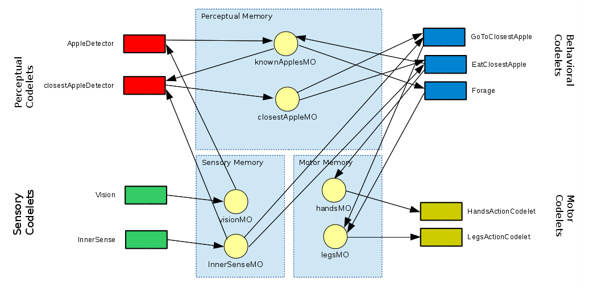
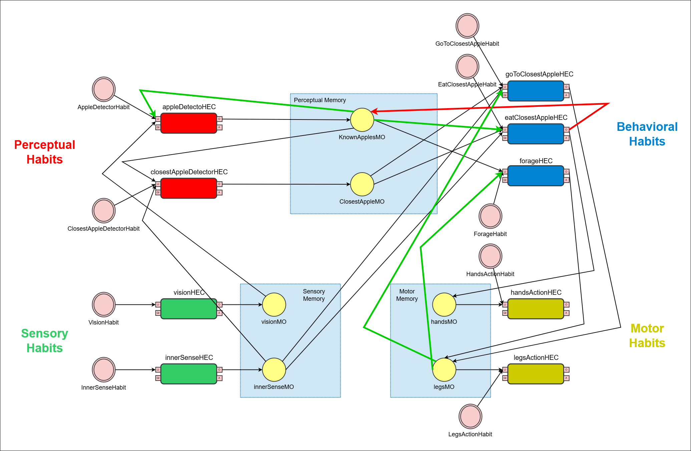

# `DemoCST-Habits`

This project was developed as part of the Cognitive Architectures research line from 
the Hub for Artificial Intelligence and Cognitive Architectures (H.IAAC) of the State University of Campinas (UNICAMP).
See more projects from the group [here](https://github.com/brgsil/RepoOrganizer).

[![](https://img.shields.io/badge/-Arq.Cog-black?style=for-the-badge&labelColor=white&logo=data:image/svg%2bxml;base64,PD94bWwgdmVyc2lvbj0iMS4wIiBlbmNvZGluZz0iVVRGLTgiPz4gPHN2ZyB4bWxucz0iaHR0cDovL3d3dy53My5vcmcvMjAwMC9zdmciIHdpZHRoPSI1Ni4wMDQiIGhlaWdodD0iNTYiIHZpZXdCb3g9IjAgMCA1Ni4wMDQgNTYiPjxwYXRoIGlkPSJhcnFjb2ctMiIgZD0iTTk1NS43NzQsMjc0LjJhNi41Nyw2LjU3LDAsMCwxLTYuNTItNmwtLjA5MS0xLjE0NS04LjEtMi41LS42ODksMS4xMjNhNi41NCw2LjU0LDAsMCwxLTExLjEzNi4wMjEsNi41Niw2LjU2LDAsMCwxLDEuMzY4LTguNDQxbC44LS42NjUtMi4xNS05LjQ5MS0xLjIxNy0uMTJhNi42NTUsNi42NTUsMCwwLDEtMi41OS0uODIyLDYuNTI4LDYuNTI4LDAsMCwxLTIuNDQzLTguOSw2LjU1Niw2LjU1NiwwLDAsMSw1LjctMy4zLDYuNDU2LDYuNDU2LDAsMCwxLDIuNDU4LjQ4M2wxLC40MSw2Ljg2Ny02LjM2Ni0uNDg4LTEuMTA3YTYuNTMsNi41MywwLDAsMSw1Ljk3OC05LjE3Niw2LjU3NSw2LjU3NSwwLDAsMSw2LjUxOCw2LjAxNmwuMDkyLDEuMTQ1LDguMDg3LDIuNS42ODktMS4xMjJhNi41MzUsNi41MzUsMCwxLDEsOS4yODksOC43ODZsLS45NDcuNjUyLDIuMDk1LDkuMjE4LDEuMzQzLjAxM2E2LjUwNyw2LjUwNywwLDAsMSw1LjYwOSw5LjcyMSw2LjU2MSw2LjU2MSwwLDAsMS01LjcsMy4zMWgwYTYuNCw2LjQsMCwwLDEtMi45ODctLjczMmwtMS4wNjEtLjU1LTYuNjgsNi4xOTIuNjM0LDEuMTU5YTYuNTM1LDYuNTM1LDAsMCwxLTUuNzI1LDkuNjkxWm0wLTExLjQ2MWE0Ljk1LDQuOTUsMCwxLDAsNC45NTIsNC45NUE0Ljk1Nyw0Ljk1NywwLDAsMCw5NTUuNzc0LDI2Mi43MzlaTTkzNC44LDI1Ny4zMjVhNC45NTIsNC45NTIsMCwxLDAsNC4yMjEsMi4zNDVBNC45Myw0LjkzLDAsMCwwLDkzNC44LDI1Ny4zMjVabS0uMDIyLTEuNThhNi41MTQsNi41MTQsMCwwLDEsNi41NDksNi4xTDk0MS40LDI2M2w4LjA2MSwyLjUuNjg0LTEuMTQ1YTYuNTkxLDYuNTkxLDAsMCwxLDUuNjI0LTMuMjA2LDYuNDQ4LDYuNDQ4LDAsMCwxLDIuODQ0LjY1bDEuMDQ5LjUxOSw2LjczNC02LjI1MS0uNTkzLTEuMTQ1YTYuNTI1LDYuNTI1LDAsMCwxLC4xMTUtNi4yMjksNi42MTgsNi42MTgsMCwwLDEsMS45NjYtMi4xMzRsLjk0NC0uNjUyLTIuMDkzLTkuMjIyLTEuMzM2LS4wMThhNi41MjEsNi41MjEsMCwwLDEtNi40MjktNi4xbC0uMDc3LTEuMTY1LTguMDc0LTIuNS0uNjg0LDEuMTQ4YTYuNTM0LDYuNTM0LDAsMCwxLTguOTY2LDIuMjY0bC0xLjA5MS0uNjUyLTYuNjE3LDYuMTMxLjc1MSwxLjE5MmE2LjUxOCw2LjUxOCwwLDAsMS0yLjMsOS4xNjRsLTEuMS42MTksMi4wNiw5LjA4NywxLjQ1MS0uMUM5MzQuNDc1LDI1NS43NSw5MzQuNjI2LDI1NS43NDQsOTM0Ljc3OSwyNTUuNzQ0Wm0zNi44NDQtOC43NjJhNC45NzcsNC45NzcsMCwwLDAtNC4zMTYsMi41LDQuODg5LDQuODg5LDAsMCwwLS40NjQsMy43NjIsNC45NDgsNC45NDgsMCwxLDAsNC43NzktNi4yNjZaTTkyOC43LDIzNS41MzNhNC45NzksNC45NzksMCwwLDAtNC4zMTcsMi41LDQuOTQ4LDQuOTQ4LDAsMCwwLDQuMjkxLDcuMzkxLDQuOTc1LDQuOTc1LDAsMCwwLDQuMzE2LTIuNSw0Ljg4Miw0Ljg4MiwwLDAsMCwuNDY0LTMuNzYxLDQuOTQsNC45NCwwLDAsMC00Ljc1NC0zLjYzWm0zNi43NzYtMTAuMzQ2YTQuOTUsNC45NSwwLDEsMCw0LjIyMiwyLjM0NUE0LjkyMyw0LjkyMywwLDAsMCw5NjUuNDc5LDIyNS4xODdabS0yMC45NTItNS40MTVhNC45NTEsNC45NTEsMCwxLDAsNC45NTEsNC45NTFBNC45NTcsNC45NTcsMCwwLDAsOTQ0LjUyNywyMTkuNzcyWiIgdHJhbnNmb3JtPSJ0cmFuc2xhdGUoLTkyMi4xNDMgLTIxOC4yKSIgZmlsbD0iIzgzMDNmZiI+PC9wYXRoPjwvc3ZnPiA=)](https://github.com/brgsil/RepoOrganizer)

## Motivation

It's desired to implement an assimilation model with CST. However, it isn't possible to do so with the current codelet structure. Because of that, a new structure is proposed to implement this model: the Habits.

Habits are executionable actions that can be used to generate new ideas. But, because a Habit is also an idea, it can, then, generate also a new habit. Since we can simulate the same behavior of a codelet with the usage of a habit, it's then possible to generate the equivalent of new codelets at runtime.

To test the possibility of using Habits to work as Codelets, it was proposed to transform DemoCST (a codelets based structure) into DemoCST-Habits, a structure that uses Habits instead of codelets.

## Current problems:

This transition from codelets to habits is still a work in progress. Although it's possible to make DemoCST work with Habits, there some workarounds that are not ideal.

- ### Habit can't output 2 ideas
    CST still doesn't support a habit that wants to output 2 ideas to 2 different MemoryObjects.

    Because of that, there is that red arrow from eatClosestApple. That relation isn't really added in the code.

    However, the code still works because its possible to write on the KnwonApplesMO by reference, since it's a list. It's not ideal, so CST must be adapted to better support this case.

- ### No Memory Containers

    CST still doesn't support the use of Memory Containers with Habits. 

    Because of that, it was needed to add 2 new green arrows to simulate the use of a Memory Containeer: the 2 green arrows coming from the legsMO (one to goToClosestApple and the other to forage).

    The CST's code is being adapted to better support the use of Memory Containers.

## DemoCST with Codelets (for comparison)

## DemoCST with Habits

- Green arrow: new relation added.
- Red arrow: "fake" relation - not passed as output, but by reference (bug).

## Acknowledgements

This project is part of the Hub for Artificial Intelligence and Cognitive Architectures
(H.IAAC- Hub de Inteligência Artificial e Arquiteturas Cognitivas). Project supported by the brazilian Ministry of Science, Technology and Innovations, with resources from Law No. 8,248, of October 23, 1991.